# Worksheet 1: Memory, Linked Lists, Array Lists

Initial due date: 2026-09-09 23:59 PT

## Review

1. Review how Java's memory is laid out, and the difference between the stack and the heap.

    1. In your own words, explain what a stack is, and what kind of data goes on the stack.

    2. In your own words, explain what a heap is, and what kind of data goes on the heap.

2. Java has two ways of testing if two objects are the same - `==` and `.equals()`. You might have been told to always use `.equals()`, but there *are* cases where `==` is useful.

    1. Read some of the search results from Google on how these are different, then in your own words, explain what `==` does and why you would want to use `.equals()` most of the time. 

    2. Could two objects be `==` but not `.equals()`? What about `.equals()` but not `==`?

3. `null` is a special value in Java for reference variables that do not currently refer to anything. We will sometimes use the &empty; symbol to represent `null`. In the code from the video (below), on which line(s) would a variable be set to `null`?

    ```java
    public class MemoryModel {

        static class Engine {
            String name = "Turbo";
        }

        static class Car {

            int id;
            int hp;
            Engine myEngine;

            public Car(int id) {
                this.id = id;
            }
        }

        public static void main(String[] args) {
            int age;
            age = 12;
            age = 15;
            String name = "";

            Car myCar;
            myCar = new Car(1);
            myCar = new Car(2);

            Car my2Car = new Car(3);
            my2Car.hp = 120;

            Car my3Car = new Car(4);
            my3Car.hp = 1000;

            Engine bigEngine = new Engine();
            my3Car.myEngine = bigEngine;
        }

    }
    ```

4. The goal of this question is for you to practice translating from Java code to what is happening in memory, and vice versa.

    1. Draw the stack and heap at the indicated place in the code. You can use [Java Tutor](http://pythontutor.com/java.html) to check your answer. Make sure you select "render all objects on the heap" and "draw pointers as arrows".

        ```java
        public class Worksheet {

            public static int twice(int n) {
                int result = 2 * n;
                // DRAW MEMORY AT THIS POINT
                return result;
            }

            public static int thrice(int n) {
                int result = 3 * n;
                return result;
            }

            public static int sixce(int n) {
                return twice(thrice(n));
            }

            public static void main(String [] args) {
                int n = 7;
                System.out.println(sixce(n));
            }

        }
        ```

    2. Arrays are also reference variables, and are therefore stored on the heap. In the code below, we create an array of three elements, then set the 0th element to 37 and the 1st element to 42. Using [Java Tutor](http://pythontutor.com/java.html) to check your answer, draw the stack and heap at the indicated place in the code.

        ```java
        public class Worksheet {
            public static void main(String[] args) {
                int[] array = new int[3];
                array[0] = 37;
                array[1] = 42;
                // DRAW MEMORY AT THIS POINT
            }
        }
        ```

    3. Draw memory at the indicated place in the code. Explain why that is the result.

        ```java
        public class Worksheet {
            public static void main(String[] args) {
                String[] array = new String[3];
                array[1] = "hello";
                // DRAW MEMORY AT THIS POINT
            }
        }
        ```

    7. Consider the two (equivalent) diagrams of memory below. Change the code marked `FIXME` so that memory will be as depicted at the indicated place in the code.

        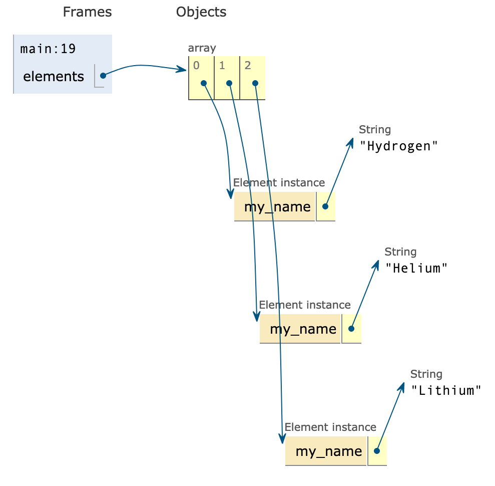

        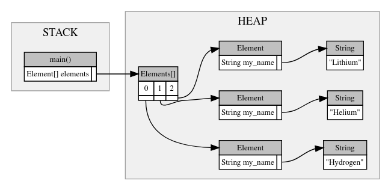

        ```java
        public class Worksheet {

            static class Element {
                private String my_name;

                public Element(String name) {
                    this.my_name = name;
                }

            }

            public static void main(String[] args) {
                Element[] elements = new Element[3];
                // FIXME

                // MEMORY DRAWN AT THIS POINT
            }

        }
        ```

5. The goal of this question is for you to practice more complicated memory manipulation, and to practice accessing the heap from the stack (in code).

    1. Consider the following diagram of memory. Change the code marked `FIXME` so that memory will be as depicted at the indicated place in the code. The person Lena has been created for you. If you wish, you may write additional functions to help you, but those functions must have returned by the indicated place in the code.

        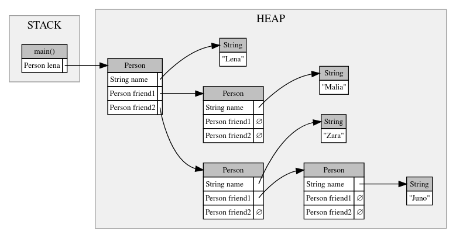

        ```java
        public class Worksheet {

            static class Person {
                String name;
                Person friend1;
                Person friend2;
            }

            public static void main(String[] args) {
                Person lena = new Person();
                lena.name = "Lena";

                // FIXME

                // MEMORY DRAWN AT THIS POINT
            }

        }
        ```

    2. Starting with your answer to the previous question, by only _adding_ code to the bottom of `main()` and _without_ creating a new Person, change memory so that the _heap_ matches the following diagram. The stack can contain whatever functions and variables you want.

        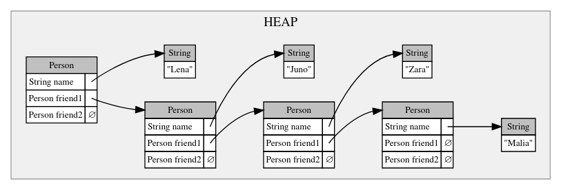

## Explore

In this section, you will be finishing the `IntArrayList` class, which implements an array list for integers. The starter code for this question is in `IntArrayList.java`, which you can download to work on in your own Java IDE. In addition to answering the questions here, you should also submit your code to [the autograder](https://autograder.oxy.edu/), which will run the test cases for you.

1. First, we need to be able to create an IntArrayList. Find the public constructor method. What member variables will it need to set? Add those member variables at the first `FIXME`, above the method declaration.

2. Fill in the missing code inside the constructor, making sure to set the member variables you just added.

3. This is an easy one - we should be able to quickly check the current size of our IntArrayList. Write the `size()` method to return the current actual size.

4. Now that we can create an IntArrayList and check its size, let's start putting elements in there. Fill in the `add()` method, which adds a given element to the end of an IntArrayList. You do *not* need to worry about resizing for now.

5. Once we have put a few variables inside our IntArrayList, we should be able view them. Write the` get()` method, which takes an index and returns the element that is at index in the IntArrayList.

6. To complete our `IntArrayList` implementation, we need to be able to resize the array. This is done via the private `resize()` method. Using the following memory diagrams as a guide, write the `resize()` method.

    1. First create a new larger array.

        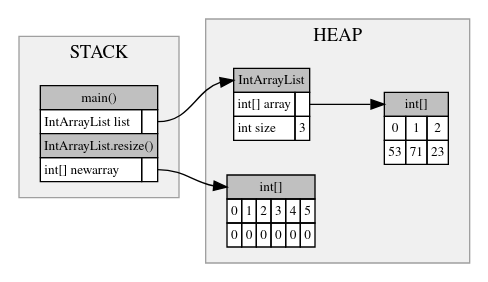

    2. Then copy the values over.

        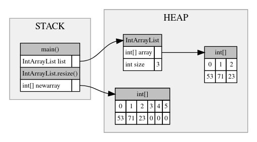

    3. Finally, set IntArrayList.array to the new larger array.

        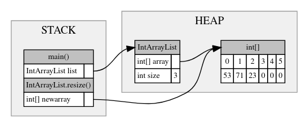

7. Now that we have the resize() function, update your `add()` method to make use of `resize()`.

8. Finally, implement the `remove()` method, which removes the element at a given index in an `IntArrayList`. Remember to shuffle the elements back to fill the gap!

## Challenge

In this section, you will be finishing the `IntLinkedList` class, which implements a singly-linked list for integers. The starter code for this question is in `IntLinkedList.java`, which you can download to work on in your own Java IDE. In addition to answering the questions here, you should also submit your code to [the autograder](https://autograder.oxy.edu/), which will run the test cases for you.

1. The inner Node class, as well as the `IntLinkedList` constructor, has been written for you. Explain what each of `Node.data`, `Node.next`, `IntLinkedList.head`, `IntLinkedList.tail`, and `IntLinkedList.size` is for. Additionally, draw memory at the point in the code marked "CQ1"

2. The `size()` method should return the current number of elements in our IntLinkedList. Fill out the code for `size()`.

3. Consider the following memory diagrams for what happens when we call `add(53)`, then `add(71)`, then `add(23)`, and finally `add(89)`. Note that the code for `add()` should be broken down into two cases. Write the code for `add()` when you understand what the cases are and how the method should work.

    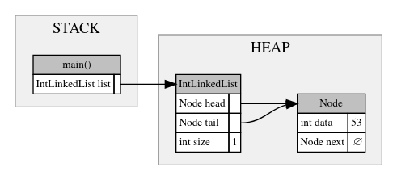

    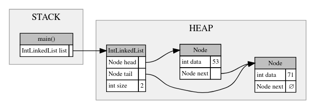

    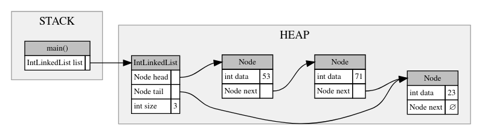

    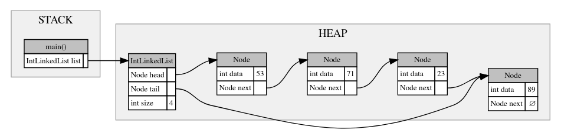

4. The next method, `get()` requires looping through the nodes to get to the correct index. Write the code for `get()`.

5. The final method, `remove()`, can be broken down into four cases (or five cases, if the final case is when the index is out of range). What are they? Write the code for `add()` when you understand what the cases are and how the method should work.
