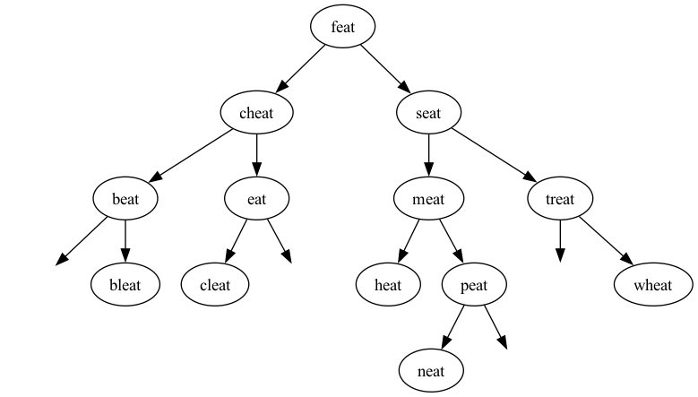

# Worksheet 3: (Self-Balancing) Binary Search (Trees)

Initial due date: 2026-10-04 23:59 PT

## Review

1. In your own words, explain how binary search on an array or array list works, and why it has worst-case runtime complexity of O(log N).

2. In your own words, explain the difference between a binary search tree (BST) and an AVL tree. Why are AVL trees a necessary improvement on BSTs?

3. Consider the following binary tree:

    ```shell
             54
           /    \
          /      \
        15        62
       /  \      /  \
      7    17  62    67
     /
    5 
    ```

    1. Is this a binary search tree? Why/Why not?

    2. What is the root node? What are the internal nodes? What are the leaf nodes?

    3. For each of the nodes 5, 7, 54, and 67, state their height and their balance.


## Explore

1. Consider the following naive implementation of binary search on a linked list. You should assume the linked list is sorted, and that the algorithm will give the correct answer. What is its worst-case runtime complexity? Justify your answer.

    ```java
    int binarySearch(IntLinkedList list, int target) {
        int mid = 0;
        int low = 0;
        int high = list.size() - 1;
        while (high >= low) {
            mid = (high + low) / 2;
            int mid_value = list.get(mid);
            if (mid_value < target) {
                low = mid + 1;
            } else if (mid_value > target) {
                high = mid - 1;
            } else {
                return mid;
            }
        }
        return -1; // not found
    }
    ```

2. This question asks you to insert several strings one after the other into an AVL tree. Assume that the strings follow dictionary order, i.e., `"trie"` comes before `"tries"`, which comes before `"try"`. For each inserted string, you should draw (a) the tree with the new node, _before_ any rotations; and (b) the tree after _each_ rotation (that is, if you need to do a double-rotation, you should draw two diagrams).

    1. try
    2. tries
    3. ties
    4. why
    5. wry
    6. vie
    7. trie

3. This question asks you to remove several strings one after the other from the AVL tree below. (The empty nodes are for spacing only, and should be read as `null`.) Assume that the next largest (ie. subsequent) value will be used to replace a node. For each removed string, you should draw (a) the tree with the removed string replaced by the successor, _before_ any rotations; and (b) the tree after _each_ rotation (as before, a double rotation would require two diagrams).

    

    1. cheat
    2. eat
    3. feat

## Challenge

These challenge questions here are designed to get you thinking about recursive functions on trees. I recommend at least trying these before attempting the AVL tree project.

1. Complete the function `int sum()` in `BinaryTreeFunctions.java`, with adds up the values in a binary tree and returns the total. You should do so by writing a recursive helper function that should run in O(N) time. Submit your code to the autograder _and_ include it below, with an additional explanation of the runtime complexity of your function.

2. Complete the function `boolean isBinarySearchTree()` in `BinaryTreeFunctions.java`, which returns `true` if and only if a binary tree is a binary search tree. You should do so by writing a recursive helper function that should run in O(N) time. Submit your code to the autograder _and_ include it below, with an additional explanation of the runtime complexity of your function.

    Hint: What must be tree about a node and its left and right subtrees if it is a binary search tree? If that relationship doesn't hold for any node, you know that the tree as a whole is not a binary search tree.

    Note: this is a challenging question, and it's doubly important that you understand what the subproblem(s) are and how it relates to the original problem. You should have a clear idea of what should happen before you start writing code.
